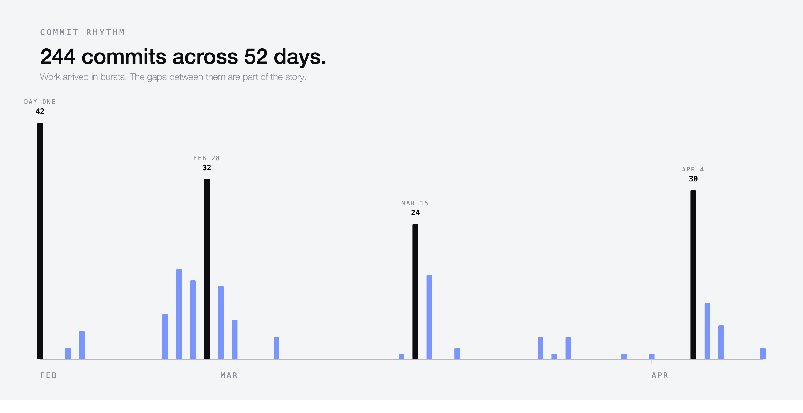
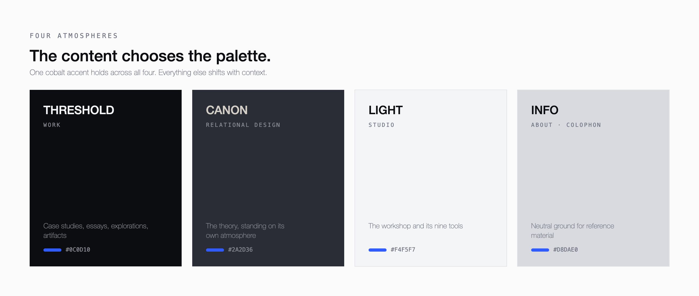
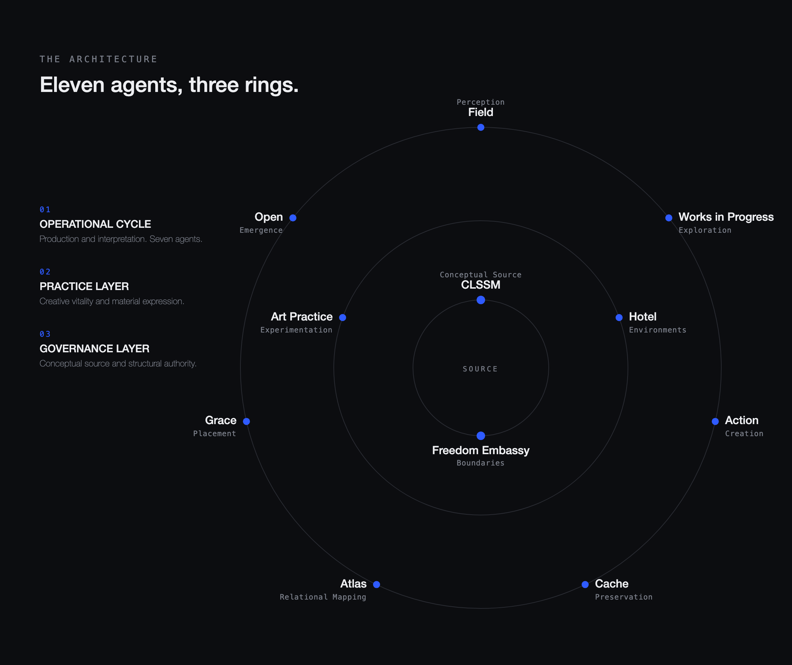
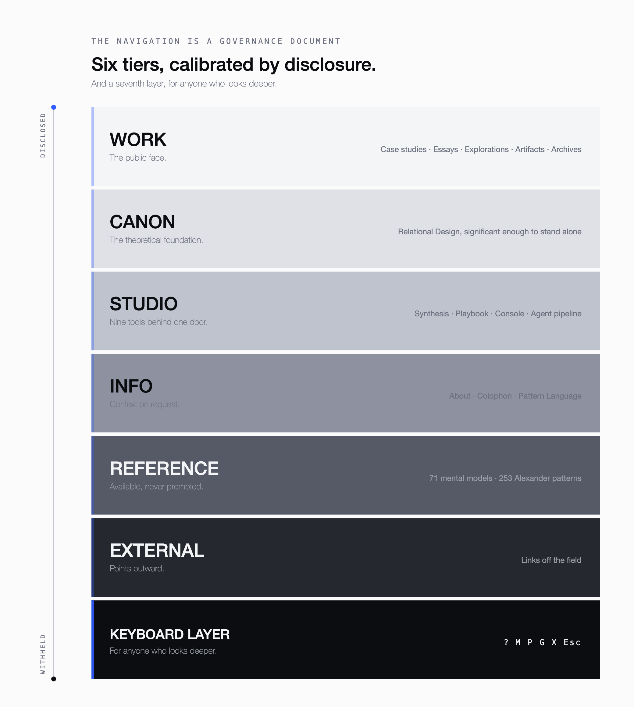
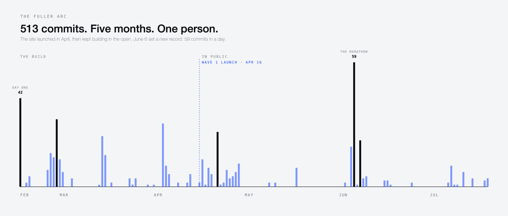

 # Building Field of Action

**244 commits. 52 days. The story of building a site that holds more than it shows.**

*Commits per day, February 16 to April 9. The work came in bursts, with long quiet stretches between them.*

---

On February 16, 2026, the first commit was made to a project called ASU Governed Surface. By April 9, it had a different name, a different typeface, a different navigation structure, and 956 archived images it hadn't planned for. The name changed twice. The font changed three times. The hero element went through fifteen iterations and still isn't finished.

This is the story of building Field of Action — a publishing platform, design portfolio, and interactive research workbench — from an empty directory to a living site. One person designed, wrote, and coded every part of it. No templates. No borrowed design system. No CMS. Just React, a data model, and a question that turned out to be harder than any technical problem: what do you show, and what do you keep for yourself?

---

## Day One

Forty-two commits in a single day. That was not a typo and it was not a tentative start.

The first commit established the full architecture: React 19 and Vite, a single-page application with a seed data model holding every piece of content in one file. By the end of February 16, the site had four case studies — Apple Music, Google Cloud, Vevo, Tribeca Festival — along with writing covers, section filters, audio playback wired to Substack, a settings panel connected to the Anthropic API, and a backstage agent pipeline with deterministic sequence prompts.

The data model, the routing, the component architecture, and the AI integration were all established before sundown. Not because the decisions were obvious, but because the decisions had already been made elsewhere — in notebooks, in conversations, in years of practice. The code was just where the decisions became structure.

The project's name at this point was ASU Governed Surface. ASU stood for Action Systems Universal — the operational infrastructure behind the practice. The word that mattered most, though, was the one in the middle: *Governed*.

---

## The Writing Section Problem

Two days later, the writing section went through five distinct layouts:

First, essay cover artwork displayed on cards. Then a split layout — art zone on one side, text zone on the other. Then an editorial contents-page arrangement. Then a five-row columnar grid. Then, finally, a clean list. Spacing and hover states. Nothing else.

The clean list won. It would survive every subsequent redesign. This was the first instance of a pattern that would repeat across the entire build: features were added, evaluated against the actual feeling of the page, and removed. Decoration lost to typography every time. The site found a principle early — spacing and type weight can do the work that borders, cards, and containers usually get asked to do — and held it for the remaining fifty days.

Exploration and Artifacts went through the same compression. Cards and tiles became typographic rows. The filter system was separated from the navigation — plain text links with underline active states, no visual weight competing with the content itself.

---

## Three Names

The project changed its name twice in fifty-two days. Each name marked a different understanding of what the site was for.

**ASU Governed Surface** was the first. Action Systems Universal — a systems architecture name, technical and internal. The "Governed Surface" part was the interface layer: a controlled view into the system underneath. This name thought of the site as an output of the practice.

**Field Intelligence** came next, briefly. It reframed the site from a system output to an active sensing apparatus — something that collects, interprets, and responds. This name thought of the site as an instrument.

**Field of Action** was the last. It dropped the intelligence framing for something more spatial and less self-referential. A field of action is a territory where things happen. Not a system describing itself. Not an instrument measuring the world. A place where design, writing, theory, and making coexist because they share the same ground.

The renaming was not just cosmetic. Traces of every name still live in the codebase. The state management hook is still called `useASUStore`. The localStorage key is still `asu-store`. The package name is still `asu-temp-scaffold`. Every agent prompt still contains the phrase "within Action Systems Universal." The public-facing surfaces say Field of Action; the infrastructure still remembers where it came from.

The transition is conceptual before it is structural. From system to field — from closed architecture to open, living terrain.

---

## Finding the Face

On February 26, a Design Intelligence Brief was applied to the site. Space Grotesk typography. Sharp geometry. Wide spacing. Mossy and vermillion accent colors. It was a strong direction — legible, confident, contemporary.

*The Design Intelligence Brief in place: Space Grotesk, sharp geometry, the "Applied awareness" headline. It started getting quieter within the day.*

It lasted less than a day. The display weights were immediately softened — dropped from bold to medium. Headings went from 500 to 400. Decorative uppercase tracking was removed. The site didn't want to shout.

The font changed to Atlas Grotesk, loaded through Adobe Fonts. This was the second typeface in two days. Then, two days later, during the motion and navigation overhaul, it changed again to Inter. Three typefaces in a week, each one quieter than the last.

The same day the first font was applied, a generative hero background was built with Three.js — cycling visual modes with glass ecology symbols rendered in real time. It was technically impressive and conceptually relevant. It was also simplified within hours to an ambient gradient. Then given mouse responsiveness. Then contained in a rounded window panel beside the headline. Then floated so the text overlapped naturally.

Each of these was a real idea, built and tested. Each was replaced not because it was wrong, but because it drew too much attention to itself. The site kept asking for less.

---

## The Most Intense Day

February 28 produced thirty-two commits. It was the day the site became a place instead of a page.

Page transitions were added — fade and stagger animations between views. Scroll-reveal animations appeared, driven by IntersectionObserver. A custom cursor effect was applied site-wide. An interactive network diagram was built, showing how every piece of content connects to every other piece through shared tags and relations. Video embeds were integrated into detail pages. A sidebar navigation was designed, then immediately converted to a hamburger menu when it competed with the content.

The most significant change was contextual theming. The site went from one color palette to four, each automatically applied based on where you are:

**Threshold** — the Work section. Near-black background (`#0C0D10`). The content sits in a dark room. This is the public face: case studies, essays, explorations, artifacts.

**Canon** — the Relational Design theory page. Slate (`#2A2D36`). Slightly warmer, slightly lifted. Important enough to get its own atmosphere.

**Light** — the Studio tools. Bright background (`#F4F5F7`). A workshop. The generative tools, the playbook, the console, the agent pipeline all live here.

**Info** — About, Colophon, Pattern Language. Medium grey (`#D8DAE0`). Neutral ground for reference material.

The themes share one accent color — cobalt blue (`#2F5BFF`) — across all four palettes. Everything else shifts. The site breathes differently depending on what you're reading. You don't choose a theme. The content chooses it for you.

*Four palettes, one accent. The section you are reading decides the atmosphere.*

---

## The Governance Decision

Somewhere between the architecture being built and the navigation being finalized, a question that had been present since the first commit became unavoidable: how much of this should anyone see?

The site was filling up with material that revealed not just the work, but the working process. An interactive connections graph mapped every relationship between every piece of content. An eleven-agent AI architecture — three rings of specialized agents with names like Field, Cache, Atlas, Grace, and Freedom Embassy — powered the studio tools. A diagnostic X-ray system could be overlaid on the Relational Design theory page, surfacing signal, inflation, and shadow in the framework's own structure. Dual-lens overlays could tag every work item with its conceptual models or its connections to Christopher Alexander's pattern language.

All of these features work. They are not prototypes or sketches. They reveal how the mind behind the site actually operates — what it reads through, what it connects, what it uses to make decisions.

*The eleven-agent architecture: seven agents in the operational cycle, two in the practice layer, two at the governance core.*

The pull to share all of it was real. But the governance layer — that word from the very first commit — kept asserting itself. One by one, features migrated behind thresholds:

The connections graph moved from the home page to a keyboard shortcut. Press G, and the network appears. Close it, and it's gone. The eleven-agent architecture moved from a visible section on the About page to a click-to-reveal interaction — you have to ask for it. The X-ray diagnostic became a keyboard shortcut on the Canon page. The Model Lens and Pattern Lens became M and P keys. The system condition — what's being read, built, and worked on right now — became the ? key.

The navigation itself became the governance document. Six tiers, each calibrated:

**WORK** is the public face. Four content types anyone can browse. **CANON** is the theoretical foundation — significant enough to stand alone. **STUDIO** holds nine interactive tools, collapsed behind a single door. **INFO** offers context on request. **REFERENCE** makes the knowledge base available — seventy-one mental models, two hundred and fifty-three Alexander patterns — without promoting it. **EXTERNAL** points outward.

And then there is a seventh layer — the keyboard shortcuts — for anyone who looks deeper. The site rewards attention without demanding it. You can visit and see the work. You can stay and find the infrastructure. Neither experience is diminished by the existence of the other.

*Six navigation tiers ordered by how much they disclose, with a seventh keyboard layer beneath them.*

---

## The Hero Problem

The hero element — the first thing any visitor sees — carries the full weight of this tension. It has been through more iterations than any other part of the site, and it still is not finished.

*One of the hero's many states: the dark Threshold treatment, headline over the Selected Work list.*

Three modes were designed and built:

**Mode 1** is the Threshold Strip. A headline — *Designing Structure for Living Systems* — and a nowbar showing what's currently being read, built, and worked on. It says almost nothing. The work below it speaks for itself.

**Mode 2** is the Signal Bar. A dashboard grid showing five data points — Practice, Position, Attention, Building, Writing — followed by a cycling headline that rotates through four slides: the site's thesis (*Designing Structure for Living Systems*), the word ACTION rendered in material textures, a quieter line (*Push Gently into the Universe*), and the site's identity (*Field of Action — Professional interface of Alfred (Daniel) Dickson II*).

**Mode 3** is the Ambient Dashboard. The same grid, plus a threshold arc — a large circle implying a horizon — behind the headline and a bio paragraph. Maximum disclosure. It tells you who, what, where, and how.

The hero went through at least fifteen commits of adjustments. Body copy was added, then removed. A bio line appeared, then disappeared. Dashboard values were tested — "Building: Energetic Fields," "Position: Design Leader at Apple TV" — then reverted. The Three.js generative background was built and discarded. A threshold arc was added, widened to 900 pixels, then expanded to 1400 for a flatter curve.

A constant called `HERO_MODE` still sits at the top of the main page component, set to 2. It is still listed as an open item in the launch plan, one week before the site goes live.

The hero is unresolved because the tension it holds is real. It is the door. How much do you reveal at the door? Enough to orient a visitor, but not enough to flatten the experience of walking through.

---

## The Archives

The site was not planned to hold archives. Then it held two of them, containing nine hundred and fifty-six images.

### Patio Beach

Between 2018 and 2021, a daily walking route along the Gowanus Canal in Brooklyn produced 556 photographs — objects found on the street, discarded things, patterns in neglected surfaces. They were originally posted to Instagram, each with a caption and occasionally with contributor attribution.

*The archive opens as a narrative scroll rather than a grid: the text introduces the photographs before you reach them.*

The archive was built as a narrative scroll. Not a grid of images with a title, but a text that unfolds alongside the photographs, structured in five movements:

The first movement describes the walking route becoming a ritual. The second places the canal in context — a Superfund site absorbing the city's industrial history. The third turns inward, connecting the discarded objects to what Carl Jung described as the shadow: the parts of identity we suppress or set aside. The fourth introduces the bowerbird — a species that builds elaborate structures from found objects — as an analog for what the practice had been doing without realizing it. The fifth credits the photographer's son for slowing his attention enough to see what was already there.

The archive includes AI-generated tags for multi-dimensional filtering — by color, material, condition, date — and a route map showing the daily walk from 302 5th Street to Rivendell School. The lightbox went through five iterations to fix viewport and cropping issues, which is the kind of detail that reveals how much the archive was cared for once the decision to include it was made.

### Share Location

Four hundred drawings made between 2019 and 2025. Monoline white paint on black 9-by-11-inch archival paper. One hundred and fifteen of them selected for the site.

The narrative framing is shorter and more interior. The practice began as a toggle between conscious control and unconscious gesture, and over time became a state of holding both at once. The drawings are a record of that state. The text calls it *superconscious* — aware of the mark being made while simultaneously surrendering to what wants to emerge.

The source files were .tif scans that required a conversion pipeline to produce web-ready thumbnails. A cropping system was built to remove white paper borders from the scanned drawings — adjusted three times, from aggressive clipping to a minimal 3-pixel inset, because too much cropping destroyed the drawing's relationship to the edge of the page.

These archives are not portfolio pieces. They are not client work or case studies. They are the parts of a creative life that usually stay private — daily walks, embodied drawing practice, the slow accumulation of attention. Including them was a governance decision. They live under the WORK tier in the navigation, alongside the professional case studies, because the site decided that the practice is the work, not separate from it.

---

## Five Reading Experiences

Every detail page on the site is a different kind of reading.

**Writing** opens with a cover image and an audio player that remembers your position when you leave — come back an hour later and it picks up where you stopped. The essay unfolds in blocks: text, artwork, video, diagrams, structured citations. Seventeen essays with audio, images from the original manuscripts, and motion artwork for two of them.

**Case studies** are editorial narratives structured in blocks — hero images, section headings, body text, two-up and three-up image layouts, pull quotes, video embeds, figures with captions. The layout is content-driven; each case study defines its own sequence of blocks in the data model.

**Theory** follows the structure of its source PDF — per-section page headers, warm stone (#D4CFC6) applied to titles, medium weight on the first line of each paragraph. The Relational Design Canon includes a colophon, abstract, six sections, principles, lineages, and works cited. On this page only, pressing X opens a diagnostic X-ray that surfaces signal, inflation, and shadow within the framework itself.

**Sketches** are work-in-progress explorations — a hypothesis at the top, then a grid of fragments (visual or text-based, each dated), then open questions, then connections to other content on the site.

**Specs** are artifact documentation — a type badge, metadata, a preview, anatomy breakdown, usage notes, and a copy-to-clipboard prompt block.

The detail overlay system handles all five types with shared open/close transitions. But the interiors are entirely different. The site does not flatten its content into a single template. Each type of thinking gets the container it needs.

---

## The Hidden Keyboard

Six keyboard shortcuts live beneath the surface of the site:

**?** opens the System Condition — a small overlay showing what is currently being read, built, and worked on. A status broadcast from the practice.

**M** activates the Model Lens. Every work item on the page gets tagged with the mental models it draws from — seventy-one models organized across four volumes (General Thinking, Physics/Chemistry/Biology, Systems/Mathematics, Economics/Art). The content reshuffles into conceptual clusters.

**P** activates the Pattern Lens. The same items get tagged with their connections to Christopher Alexander's pattern language — two hundred and fifty-three patterns cross-referenced to the site's own work. A second way of seeing the same material.

**G** opens the Connections Graph. An interactive network diagram renders every piece of content as a node, connected by shared relations. You can click a node to filter the site to only its connections.

**X**, on the Canon page only, opens the Relational X-Ray — a diagnostic tool that examines the Relational Design framework for signal, inflation, and shadow.

**Esc** closes everything.

None of these are mentioned in the navigation. None are necessary to use the site. They exist for the visitor who stays long enough to wonder if there is more — and discovers that there is.

---

## By the Numbers

| | |
|---|---|
| Total commits | 244 |
| Days of active development | 52 |
| Busiest single day | February 28 — 32 commits |
| Pages and views | 18 |
| Case studies | 4 |
| Published essays | 17 |
| Mental models | 71 |
| Alexander patterns | 253 |
| Archived images | 956 |
| Interactive studio tools | 9 |
| AI agents | 11 |
| Color themes | 4 |
| Hidden keyboard shortcuts | 6 |
| Typefaces tried | 3 |
| Hero iterations | 15+ |
| Writing layout iterations | 5 |
| Project names | 3 |

---

## What It Became

Field of Action is not a portfolio site. A portfolio displays work for an audience. This site holds a practice — the work, the thinking behind the work, the tools used to do the thinking, the references that shaped the tools, and the personal archives that preceded all of it.

The site auto-switches between four visual atmospheres based on context. It remembers your audio position across essays. It lets you overlay conceptual models on work items, or see how Alexander's patterns connect to the practice, or trace every relationship in a network diagram — if you know where to look. Every detail page is a different reading experience shaped by what it holds.

The studio tools are real and operational — an AI-powered synthesis engine, a four-pillar design playbook, a seven-laws field console, card-based orientation systems, a full eleven-agent creative pipeline. They are the infrastructure of an active practice, not demonstrations.

The navigation is a governance document. The keyboard layer is an invitation. The hero is still unfinished because the question it asks — *how much do you reveal at the door?* — does not have a clean answer. It has a position, held in tension, adjusted over time.

One person. Fifty-two days. Two hundred and forty-four commits. A site that holds more than it shows, and shows more the longer you stay.

---

## The Second Season

The account above ends one week before launch, with the hero unfinished and a launch plan full of open checkboxes. Then the door opened. Over the following hundred days the site did the thing it had only described: it went live, started transacting, changed what it called itself, and began running real work in public. Two hundred and forty-four commits became five hundred and thirteen. Fifty-two days became a hundred and fifty-five.

*Commits per day across the whole build, February 16 to July 20. The dashed line marks Wave 1 launch. Everything to its right is the site building in public.*

### The door opened

On April 16, a single commit trimmed the navigation, hid the unfinished Practice items, gated the Studio, and added the metadata a launch needs — Open Graph card, favicon, share previews. Wave 1. The site was live.

The governance question that ran through the whole build stopped being a matter of what to show on a page and became infrastructure. The build split in two: a public bundle served at the main domain, and a studio bundle gated at the edge, so `studio.fieldofaction.org` lands anyone without the password on a modal and nothing else. The dark room and the workshop became different buildings with different keys.

### The hero resolved by refusing to

The `HERO_MODE` constant that sat at `2`, flagged as an open item, now reads `4`. Mode 4 is not a fourth design. It is a shell — a component that holds several hero compositions and selects one. For Wave 1 it runs a single composition: the Signal Grid, where the headline's letters become nodes in a small relational network, pulled toward the corners on a spring, tilting to the phone's gyroscope on touch. Eight other hero sketches sit parked in the codebase, catalogued in `HEROES.md`, waiting for later waves.

This is the resolution the earlier account predicted without knowing it. The hero was never a design problem to be solved. It was a position to be held, and the door became a frame built to hold many doors. It is finished precisely because it no longer has to be.

*The hero today: Mode 4, the Signal Grid, where the letters of FIELD OF ACTION become nodes in a relational network. The masthead now reads professional research notebook, and a Hosting cell points at the Nest edition.*

### From portfolio to notebook

In June the site quietly stopped presenting itself as a portfolio. "Studio" became "Workshop" in the public navigation. The employer's name came off the social card. The About page was redrafted in the first person of a working practice, and a new grid-mark logotype replaced the earlier identity. The masthead now calls the site a professional research notebook. A portfolio shows finished work to an audience. A notebook is kept while the work is happening, in the open, whether or not anyone is reading.

### The site started making things

Two surfaces turned the site from something you read into something that produces. In late April, a storefront appeared at `/hotel/nest` — a poster, a tee, and a tote from the Nest edition, capped at one hundred, wired to live Stripe payment links. The site could take money.

*The storefront at /hotel/nest: the first Nest edition, its poster built from the Patio Beach archive, released on Earth Day.*

Then, in May, a whole new tier: Press. Where Studio holds tools for thinking, Press holds tools for production, each one named for the edition it serves. The Nest Compositor turns a photograph into social assets across four layouts and two aspect ratios, drawing directly from the Patio Beach archive. The Nest Reel spins up to fifty of those photographs into a color-shifting video. The archives, built as narrative, became feedstock. Alongside them, the Studio home reshaped into the Atrium — an orchestration surface that runs portable "field-direction bundles" through the eleven-agent ring and upstreams them to the production tools. The infrastructure the About page once described in the abstract started carrying real load. (Also, more quietly: a generative Galaxy instrument, a two-sheet résumé that exports to PDF, and a Superconscious *Bloom* that cycles a cluster of flowers against a sky keyed to the time of day.)

### The longest day

June 6 produced fifty-nine commits, nearly double the old record of thirty-two and the busiest day in the site's life. It built nothing new. The entire day went to making one thing right: the Workbench case study and its Condition Set artifact. Recasting the artifact as an instrument rather than a letter. Building a table that shows a premise decaying. Trying the reversible-chain pills in three different layouts before one held. Floating the editorial headline bands out of their containers. Promoting a worked example above the instructions for how to use it. Fifty-nine commits, one artifact, a single day given entirely to depth.

### The Atlas

The most outward-facing thing the site has done arrived in July and has nothing to do with design portfolios. The World Cup Atlas is a standalone page — one self-contained file, no build step — that treats a real football tournament as public infrastructure worth documenting. It bills itself as Cultural Infrastructure Case Study 001. Each nation is drawn as a line-art "constitution" glyph and a borderless flag. It tracked the tournament live, matchday by matchday, from the group stage to the final, scores pushed in through a small data file as they happened. Spain emerged champions, settling the final one to nil over Argentina; England took third. Arrive on the page and confetti falls once, then fades. The site stopped only documenting a practice and started performing one, in public, on a calendar it did not control.

*The World Cup Atlas: a standalone page that tracked a real tournament to its champion, confetti and all.*

---

## By the Numbers, Today

| | The build (Apr 9) | Today (Jul 20) |
|---|---|---|
| Total commits | 244 | 513 |
| Days of active development | 52 | 155 |
| Busiest single day | February 28 — 32 | June 6 — 59 |
| Published essays | 17 | 19 |
| Public tiers | 6 | 7 (added Press) |
| Interactive tools | 9 (Studio) | Studio plus Press production tools and the Atrium |
| Live storefront | none | Nest edition, wired to Stripe |
| Standalone artifacts | — | World Cup Atlas |
| Hero mode | 2 (open item) | 4 (shipped) |
| Status | one week to launch | launched — Wave 1, April 16 |

Unchanged since April: 71 mental models, 253 Alexander patterns, 11 agents across three rings, 4 contextual themes, 6 keyboard shortcuts.

---

## Where It Stands

The earlier account closed at the door and called the hero unfinished. The site walked through, and the hero turned out to be finished all along — a frame, not a picture. What was a portfolio about a practice is now the practice itself, running in the open: launched behind a governance split, selling a limited edition, generating its own promotional material, orchestrating its own agents, and documenting a World Cup as if it were civic infrastructure.

The governance question from the very first commit never got a clean answer. It got built into everything. A public build and a gated studio. A storefront and a notebook. A site kept where anyone can see it, holding more than it shows, and showing more the longer you stay.
