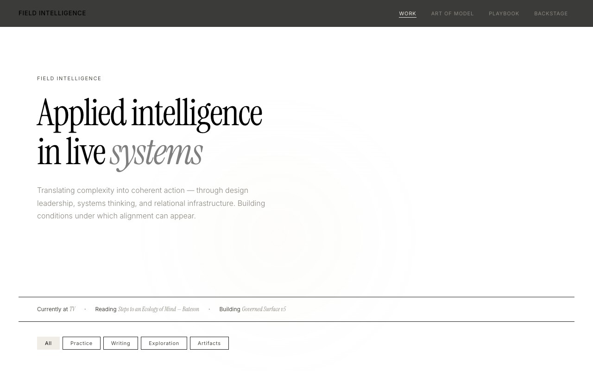
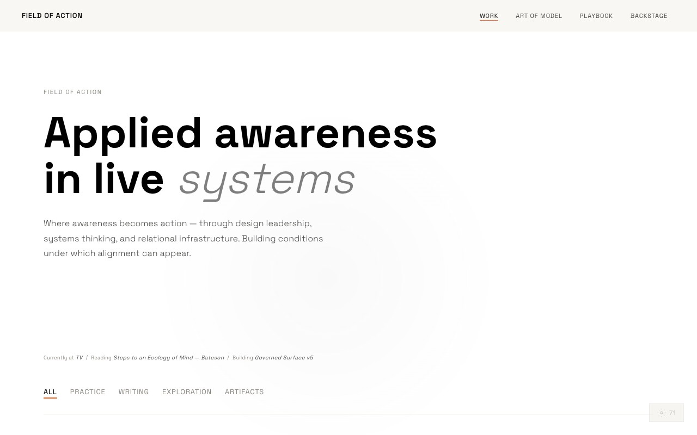
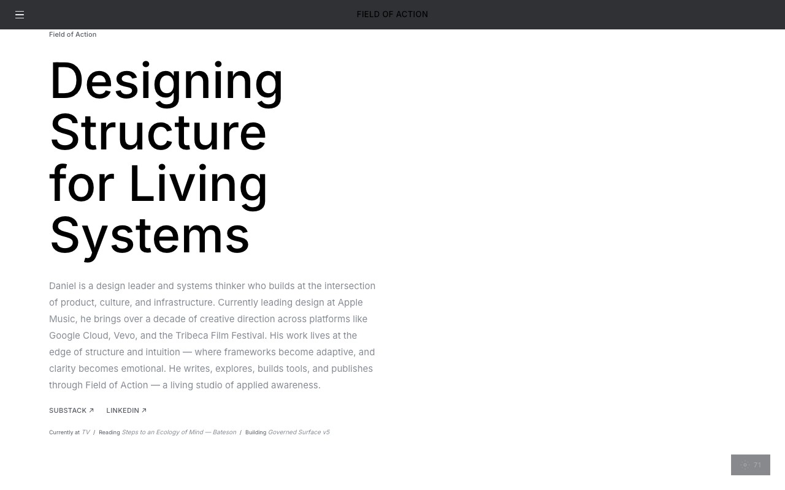
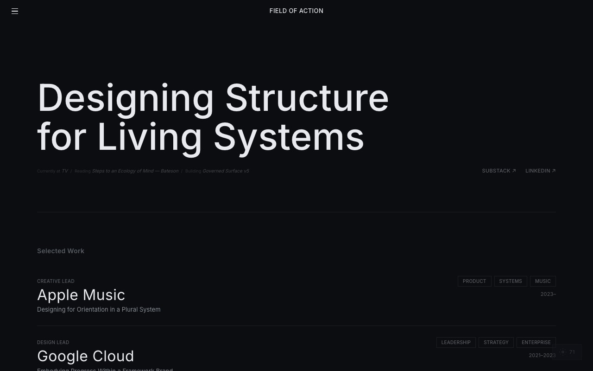
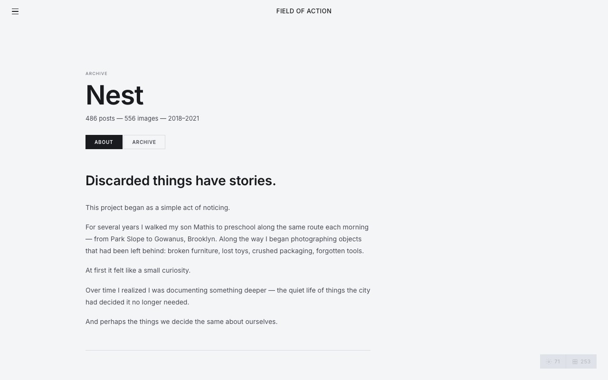
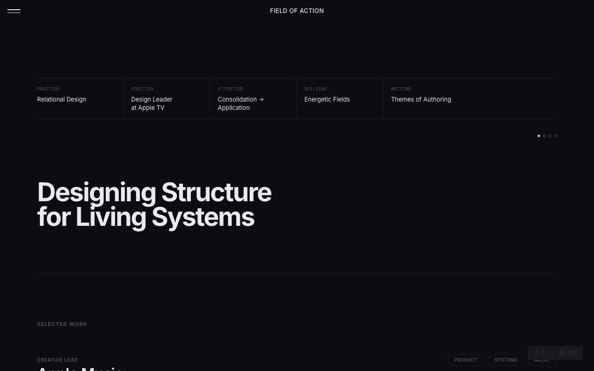
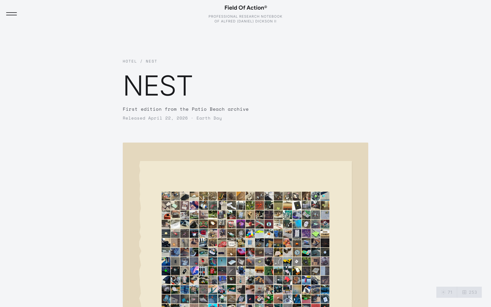
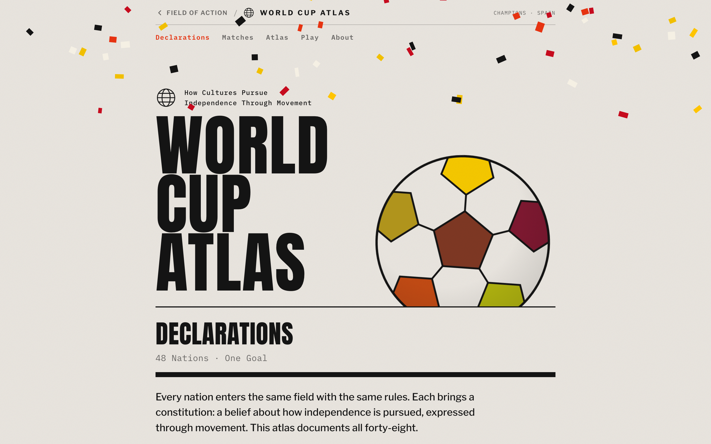

# Field of Action — Development Story

**513 commits. Five months. One designer building a living site in public.**

Field of Action is a design portfolio, publishing platform, and interactive research workbench built by Daniel Dickson — a design leader working across systems, brand, and emerging technology. What started as a single React file on February 16, 2026 became an 18-page, multi-archive, AI-integrated site by April 9. Then it launched, and kept building in the open — adding a storefront, a production tier, an orchestration layer, and a live-tracked World Cup atlas by July 20. Every line designed, written, and coded by one person.

*This is the full-arc edition. The original story covered the pre-launch build (Phases 1–10, through April 9). The Second Season below picks up at launch and runs to today.*

---

## The Central Tension: What's Public and What's Private

The word "Governed" appears in the very first commit message: *Initial ASU Governed Surface*. Before there was a navigation, before there was a hero, there was a governance question. The site was always meant to hold more than it shows.

The pull to share everything was real. Over 52 days, feature after feature was built in full view — an interactive connections graph on the home page, an 11-agent AI architecture described on the About page, diagnostic X-rays on the Canon page, dual-lens overlays that tag every work item with its conceptual models. These are not half-built experiments. They work. They reveal how the mind behind the work actually operates.

But the governance layer kept asserting itself. One by one, those features migrated behind thresholds:

| What was built | Where it started | Where it went |
|----------------|-----------------|---------------|
| Connections graph | Home page, always visible | G key — easter egg |
| 11-agent architecture | About page, visible section | Click-to-reveal — hidden by default |
| Relational X-Ray | Canon page, visible | X key — keyboard shortcut |
| System Condition | Visible on page | ? key |
| Model Lens | Visible overlay | M key |
| Pattern Lens | Visible overlay | P key |
| 9 Studio tools | 9 individual nav items | Collapsed into single "Studio" landing page |

The navigation itself *is* the governance decision. The six tiers read like a disclosure policy:

- **WORK** — the public face. Practice, Writing, Exploration, Artifacts.
- **CANON** — the theoretical foundation. Important enough to get its own theme.
- **STUDIO** — the personal workshop. Collapsed to a single door.
- **INFO** — context on request. About, Colophon.
- **REFERENCE** — the knowledge base. 71 models, 253 patterns. Visible but not promoted.
- **EXTERNAL** — outbound links. The rest of the world.

And then there's a seventh layer — the keyboard shortcuts — for anyone who looks deeper. The site rewards attention without demanding it.

### The Hero Problem

The hero element concentrates this tension into a single viewport. It's the threshold — literally the first thing a visitor encounters — and it has been through more iterations than any other part of the site. Three modes were built:

- **Mode 1 — Threshold Strip:** Just the headline and a nowbar. Says almost nothing. The site speaks for itself.
- **Mode 2 — Signal Bar:** A dashboard grid (Practice, Position, Attention, Building, Writing) plus a cycling headline. Discloses without narrating. Shows what's active without explaining why.
- **Mode 3 — Ambient Dashboard:** Full grid + threshold arc + bio. Maximum disclosure. Tells you who, what, where, and how.

The hero went through 15+ commits of iteration — adding body copy, removing it, adding a bio, removing it, trying a Three.js generative background, simplifying to a gradient, adding a threshold arc, adjusting its diameter twice, testing dashboard values, reverting them. The `HERO_MODE` constant still sits at the top of `Public.jsx`, set to `2`, still flagged as an open item in the launch plan.

The hero is unresolved because the tension is real. It's not a design problem to be solved — it's a position to be held. How much do you reveal at the door? Enough to orient, not enough to flatten the experience of going deeper.

---

## Timeline

| Phase | Dates | Commits | What happened |
|-------|-------|---------|---------------|
| Genesis | Feb 16 | 42 | Full architecture in a single day |
| Content Structure | Feb 18–19 | 7 | Five layout iterations for the writing index |
| Theory & Detail | Feb 25 | 8 | Relational Design theory page from PDF source |
| Visual Identity | Feb 26–27 | 30 | Typography, case studies, generative hero experiments |
| Motion & Navigation | Feb 28 | 32 | Full motion system, contextual theming, cursor effects |
| Hero & Index | Mar 1–2 | 20 | Three hero modes, index layout experiments |
| Architecture | Mar 5–16 | 44 | Navigation overhaul, 253-pattern reference library, dual-lens system |
| Archives | Mar 18–26 | 12 | Two visual archives — 956 images total |
| Studio Tools | Mar 24–Apr 1 | 7 | Breakground, Desert, Exploration Editor |
| Final Mile | Apr 4–9 | 48 | 65 essay images, video artwork, full citations, audio playback |
| **Wave 1 Launch** | **Apr 12–17** | **33** | **Block-based case studies, launch gate, social metadata — the site went live** |
| Commerce & Archives | Apr 19–29 | 71 | Nest storefront (Stripe), Patio Beach Reels, Atrium orchestration |
| Press & Repositioning | May–Jun 8 | 45 | Press production tier, Galaxy, Résumé, "Workshop" rename, notebook framing |
| The Workbench Marathon | Jun 6 | 59 | One artifact, all day — Condition Set recast as an instrument |
| The Atlas | Jul 7–20 | 32 | World Cup Atlas — a live-tracked tournament as public infrastructure |

---

## Phase 1: Genesis — February 16

**42 commits in a single day.** The project began under the name "ASU Governed Surface" (Action Systems Universal) — a working title that would be renamed twice before landing on Field of Action.



*An early home state, captured before the final name landed: a serif "Applied intelligence in live systems" hero.*

The first commit established the split architecture: React 19 + Vite, a single-page app with a seed data model holding all content. By end of day, the site had:

- Audio playback wired to Substack
- A settings panel with Anthropic API integration
- Four practice case studies (Apple Music, Google Cloud, Vevo, Tribeca Festival)
- Writing covers, practice rows, section filters
- A Backstage agent pipeline with deterministic sequence prompts

**Key commit:** `fd4e42f` — *Initial ASU Governed Surface — split architecture*

This was not a tentative start. The data model, routing, and component architecture were all established on day one — including the AI integration that would power the studio tools.

---

## Phase 2: Content Structure — February 18–19

The writing section went through five distinct layouts in two days:

1. Essay cover artwork on cards
2. Split art zone + text zone covers
3. Editorial contents-page layout
4. Five-row columnar grid
5. Clean list — spacing and hover only (the winner)

Exploration and Artifacts sections were rebuilt from cards and tiles into typographic rows. The filter system was separated from navigation — plain text links with underline active states, section headers getting top rules.

**This phase established a design principle that held for the rest of the build: typography and spacing over decoration.**

---

## Phase 3: Theory & Detail Pages — February 25

The Relational Design theory page was built from a source PDF — section by section, matching the original document's structure. This included:

- Per-section page headers
- Medium weight on first lines of body paragraphs
- Warm stone (#D4CFC6) applied to titles
- Sticky back button on all detail pages

The case studies were rewritten as transformation narratives. Practice detail pages got an editorial structure: framing, reframe, intervention, outcomes.

**Key moment:** The detail overlay system was established here — a unified pattern where different content types (writing, case study, theory, sketch, spec) each get their own full-screen detail view, all sharing the same open/close transitions.

---

## Phase 4: Visual Identity — February 26–27

**30 commits of design exploration.** This was the identity finding itself.

The Design Intelligence Brief was applied: Space Grotesk typography, sharp geometry, wide spacing, mossy/vermillion accents. Then immediately softened — display weights dropped to 500, headings to 400. Decorative uppercase and wide tracking were removed. The font changed from Space Grotesk to Atlas Grotesk (Adobe Fonts).



*The Design Intelligence Brief in place: Space Grotesk, sharp geometry, the "Applied awareness" headline.*

A generative hero was built with Three.js — cycling modes with glass ecology symbols. Then simplified to an ambient gradient. Then given mouse responsiveness. Then contained in a rounded window panel. Then floated with natural text overlap.

The Field Console was added as a standalone page — a 7-Laws diagram with 21 pair mechanics.

**Key rename:** `5dce25b` — *Rename Field Intelligence to Field of Action across all surfaces*

---

## Phase 5: Motion & Navigation — February 28

**The most intense single day of development: 32 commits.**

This day transformed the site from a static layout into a living environment:

- **Page transitions** — fade and stagger animations between views
- **Scroll reveals** — IntersectionObserver-based entrance animations
- **Cursor effects** — site-wide interactive cursor
- **Network diagram** — interactive node visualization showing content relationships
- **Video embeds** — native video support in detail pages
- **Sidebar navigation** — then immediately converted to hamburger menu
- **Contextual theming** — Work views auto-switch to dark, Studio to light
- **Design system overhaul** — cobalt accent, Inter typeface, refined motion

The site went from having one look to having four distinct color contexts that auto-switch based on where you are:

| Theme | Context | Background |
|-------|---------|------------|
| Threshold (dark) | Work — Practice, Writing, Exploration, Artifacts | `#0C0D10` |
| Canon (slate) | Relational Design theory | `#2A2D36` |
| Light | Studio tools — Art of Model, Playbook, Console | `#F4F5F7` |
| Info (grey) | About, Colophon, Pattern Language | `#D8DAE0` |



*A lighter direction with the Inter typeface and a full bio, one of several hero experiments from this stretch.*

---

## Phase 6: Hero & Index Experiments — March 1–2

Three hero modes were built and tested:

1. **Strip** — minimal horizontal bar
2. **Signal Bar** — data-forward, dashboard-like
3. **Ambient Dashboard** — hybrid dashboard + micro-graphic identity

The hero went through at least 15 iterations in two days — adding and removing a threshold arc, experimenting with dashboard grid values ("Building: Energetic Fields," "Position: Design Leader at Apple TV"), adding and removing body copy, adjusting line counts.

The writing section was redesigned with featured hierarchy and curated layout — then reverted to the original grid. An index layout replaced card containers across all sections.

**The lesson of this phase: simplicity won.** Features were added, evaluated, and removed. The hero landed on the Signal Bar mode. The content index landed on clean typographic rows.



*The dark Threshold hero over Selected Work, one of the three modes tested this phase.*

---

## Phase 7: Architecture & Reference — March 5–16

The biggest structural change in the project's life. The navigation was reorganized into tiers:

```
WORK        → Practice, Writing, Exploration, Artifacts, Archives
CANON       → Relational Design (its own theme)
STUDIO      → 9 interactive tools
INFO        → About, Colophon
REFERENCE   → Mental Models (71), Pattern Language (253)
```

Key additions:
- **253 Alexander patterns** — Christopher Alexander's full pattern language, imported with descriptions and cross-references to the site's own content
- **Dual-lens system** — press M to overlay model tags on items, P for pattern tags. Two entirely different ways to see the same content.
- **11-agent architecture** — expanded from a basic pipeline to a 3-ring, 11-agent system (Field, Works-in-Progress, Action, Cache, Atlas, Grace, Open + Art Practice, Hotel + CLSSM, Freedom Embassy)
- **Full essay audio playback** — native audio player with HeroCycle hero and footer maker's mark
- **Typography system** — 600 weight titles, 600 labels, tighter tracking applied sitewide

---

## Phase 8: Archives — March 18–26

Two full visual archives were built and integrated:

### Patio Beach — 556 images
A narrative scroll through an Instagram archive of curated imagery — each post with its original caption and contributor attribution. The archive includes:
- AI-generated tags for multi-dimensional filtering
- Route map visualization
- Lightbox navigation (built through 5 iterations to fix viewport and cropping issues)

### Share Location / Superconscious — 400 drawings
A collection of original drawings presented in a grid format with:
- Narrative text sections
- Conversion pipeline for source .tif files to web-ready thumbnails
- Cropping system to remove paper borders from scanned drawings

**Total: 956 archived images integrated into a single site.**



*Patio Beach opens as a narrative scroll: the text introduces the 556 images before you reach them.*

---

## Phase 9: Studio Tools — March 24–April 1

The interactive workbench expanded:

- **Breakground Card** — a card-based Field Orientation System with manual and AI-assisted hybrid modes
- **Desert** — a visual environment for compositions with image treatments
- **Exploration Editor** — an operable research journal with live enrichment overlays
- **Editorial case study layout** — block-based content system for practice detail pages

Plus the hidden features:
- **?** — System Condition overlay (reading/building/working status)
- **M** — Model Lens
- **P** — Pattern Lens
- **G** — Connections Graph (interactive network diagram)
- **X** — Relational X-Ray diagnostic (on Canon page)

---

## Phase 10: Final Mile — April 4–9

**48 commits of editorial completion.** This phase was about filling the vessel — taking every essay, every case study, every detail page from structure to substance.

- 65 essay images extracted from original .docx archives and wired into 10 essay body arrays
- Motion artwork (video) added to Art of Tolerance and Foundation essays
- Full citations completed for all 17 essays
- Canon theory diagrams added and captioned
- About page refined through 6 iterations of position statement copy
- Share toolbar, audio position persistence, and author byline added
- Video embeds fixed to show first frame instead of black



*The site as it stood in April, launch-ready: the Signal Bar hero (Mode 2), its dashboard grid still naming the employer.*

---

## By the Numbers

| Metric | Count |
|--------|-------|
| Total commits | 244 |
| Days of development | 52 |
| Most intense day | Feb 28 — 32 commits |
| Pages/views | 18 |
| Case studies | 4 |
| Essays (memos + field notes) | 17 |
| Mental models | 71 |
| Alexander patterns | 253 |
| Archived images | 956 |
| Interactive studio tools | 9 |
| AI agents | 11 |
| Themes | 4 |
| Keyboard shortcuts | 6 |
| Font changes | 3 (Space Grotesk → Atlas Grotesk → Inter) |
| Hero iterations | 15+ |
| Writing layout iterations | 5 |
| Names | 3 (ASU Governed Surface → Field Intelligence → Field of Action) |

---

## What It Became

Field of Action is not a portfolio site. It is a publishing platform that holds:

1. **Case studies** — transformation narratives from Apple Music, Google Cloud, Vevo, Tribeca
2. **Essays** — 9 memos and 8 field notes with audio, artwork, video, and citations
3. **Theory** — the Relational Design Canon with diagnostic X-rays
4. **Archives** — 956 images across two collections (Patio Beach, Share Location)
5. **Studio tools** — 9 interactive interfaces including AI-powered synthesis, card-based orientation, and a full agent pipeline
6. **Reference libraries** — 71 mental models and 253 Alexander patterns with cross-references
7. **Hidden layers** — keyboard-activated lenses, graphs, and diagnostics that reveal relationships across all content

The site auto-switches between four visual themes based on context. It remembers your audio position when you leave an essay. It lets you overlay conceptual models on work items, or see how Alexander's patterns connect to the practice. Every detail page is a different reading experience — writing has audio and artwork, case studies have intervention grids, theory has section headers matching the source PDF.

One person. 52 days. No templates, no CMS, no design system borrowed from someone else.

*And then it kept going. Everything below happened after that sentence was true.*

---

# The Second Season — April to July

The story above ends one week before launch. This is what happened after the door opened: the site went live, started transacting, changed what it called itself, and began running real work in public. 244 commits became 513. 52 days became 155.

## Phase 11: Wave 1 Launch — April 12–17

**33 commits. The site went live.** Case studies got a dynamic block system (sticky, split, device, and grid layouts) with scroll-reveals and real Vevo, Google Cloud, and Tribeca assets; videos were compressed 259MB → 62MB. Then, on April 16, a single commit shipped it: nav trimmed, unfinished Practice items gated, Studio locked, and the metadata a launch needs — Open Graph card, favicon, share previews.

The governance question became infrastructure. The build split in two: a public bundle at the main domain, and a studio bundle gated at the edge, so `studio.fieldofaction.org` lands anyone without the password on a modal and nothing else.

**Key commit:** `Wave 1 launch: hide Practice, gate Studio, trim nav` (Apr 16)


*The same view today. Set it beside the April capture above: the Signal Bar became the Signal Grid (Mode 4), the masthead became a research notebook, and "Design Leader at Apple TV" became simply "Design Leader."*

## Phase 12: Commerce & Archives — April 19–29

**71 commits.** The site started transacting. A storefront appeared at `/hotel/nest` — a poster, tee, and tote from the Nest edition, capped at 100, wired to live Stripe payment links. The Patio Beach archive gained a **Reels** view (66 IG stories in slide-mount format); Share Location got a book-page lightbox; hash-based deep-link routing landed. The Studio home reshaped into the **Atrium** — an orchestration surface that runs portable "field-direction bundles" through the eleven-agent ring (currently shape-honest mocks ahead of live interpolators).



*The Nest storefront at /hotel/nest, released on Earth Day, its poster drawn from the Patio Beach archive.*

## Phase 13: Press & Repositioning — May – June 8

**45 commits.** A whole new tier: **Press** — production tools, sibling to Studio, each named for the edition it serves. The **Nest Compositor** turns a photo into social assets (four layouts, two aspect ratios) drawing from the Patio Beach archive; the **Nest Reel** spins up to 50 photos into a color-shifting video. The archives became feedstock. Then a quiet but decisive reframing (June 8): "Studio" became "Workshop" in the public nav, the employer's name came off the social card, the About page was redrafted in a personal-practice voice, and the masthead began calling the site a professional research notebook. Also added: a generative **Galaxy** instrument and a two-sheet **Résumé** with PDF export.

## Phase 14: The Hero, Resolved — ongoing

The `HERO_MODE` constant that sat at `2`, flagged as an open item, now reads `4`. Mode 4 is a *shell* — `HeroGrid`, a component that holds several hero compositions and selects one. For Wave 1 it runs a single composition: the **Signal Grid**, where the headline's letters become nodes in a relational network, pulled to the corners on a spring, tilting to the phone's gyroscope on touch. Eight other hero sketches sit parked in `HEROES.md`, waiting for later waves. The hero was never a problem to solve; it became a frame built to hold many doors.

## Phase 15: The Workbench Marathon — June 6

**59 commits in one day — the busiest of the entire build,** nearly double the old Feb 28 record. It built nothing new. The whole day went to making one artifact right: the Workbench case study and its **Condition Set**. Recasting it as an instrument rather than a letter, building a premise-decay table, trying the reversible-chain pills in three layouts, floating editorial headline bands out of their containers, promoting a worked specimen above the how-to. A record-setting day spent entirely on depth.

## Phase 16: The Atlas — July 7–20

**32 commits.** The most outward-facing thing the site has done. The **World Cup Atlas** is a standalone page — one self-contained file, no build step — that treats a real tournament as public infrastructure worth documenting. It bills itself as *Cultural Infrastructure Case Study 001*. Each nation is drawn as a line-art "constitution" glyph and a borderless flag. It tracked the tournament live, matchday by matchday, scores pushed through a small data file as they happened. Spain emerged champions, settling the final one-nil over Argentina; England took third. Arrive on the page and confetti falls once, then fades.



*The World Cup Atlas, tracked live to its champion. Cultural Infrastructure Case Study 001.*

---

## By the Numbers — Today

| Metric | The build (Apr 9) | Today (Jul 20) |
|--------|-------------------|----------------|
| Total commits | 244 | 513 |
| Days of development | 52 | 155 |
| Most intense day | Feb 28 — 32 | June 6 — 59 |
| Published essays | 17 | 19 |
| Public tiers | 6 | 7 (added Press) |
| Live storefront | none | Nest edition (Stripe) |
| Standalone artifacts | — | World Cup Atlas |
| Hero mode | 2 (open) | 4 (shipped) |
| Status | one week to launch | launched (Wave 1, Apr 16) |

*Unchanged: 71 mental models, 253 Alexander patterns, 11 agents across 3 rings, 4 contextual themes, 6 keyboard shortcuts.*

## What It Became — Today

The April account closed at the door and called the hero unfinished. The site walked through, and the hero turned out to be finished all along — a frame, not a picture. What was a portfolio about a practice is now the practice itself, running in the open: launched behind a governance split, selling a limited edition, generating its own promotional material, orchestrating its own agents, and documenting a World Cup as if it were civic infrastructure. The governance question from the very first commit never got a clean answer. It got built into everything.

---

## Key Commits for Screenshots

To capture the visual evolution, these commits represent major visual milestones:

| Commit | What to screenshot | Visual state |
|--------|-------------------|--------------|
| `fd4e42f` | Home page | Day 1 — raw structure |
| `fbb373e` | Writing section | Clean list layout (survived) |
| `2bccbee` | Home page | Design Intelligence Brief applied |
| `43a89b3` | Any page | Atlas Grotesk era |
| `b61b99f` | Home page | Cinematic work carousel hero |
| `f810ce7` | Home page + detail | Cobalt accent, Inter type, motion |
| `3185cd7` | Multiple pages | Contextual theming live |
| `77ead32` | Home page | Three hero modes |
| `cc48732` | Home page | Index layout (final structure) |
| `4cc6a9f` | Navigation | Architecture refactor |
| `1cefc81` | Patio Beach | First archive |
| `f2d8d54` | Share Location | Second archive |
| `dca54a9` | Studio page | Collapsed studio landing |
| `9ee5fea` | Any essay | 56 artwork images wired in |
| `c51c962` | Current state | Full site, launch-ready |

To screenshot any of these: `git stash && git checkout <commit> && npm run dev`
Then return: `git checkout main && git stash pop`
